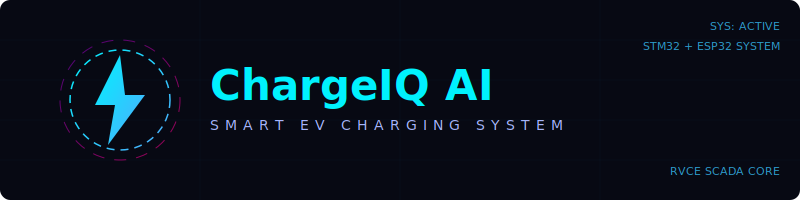
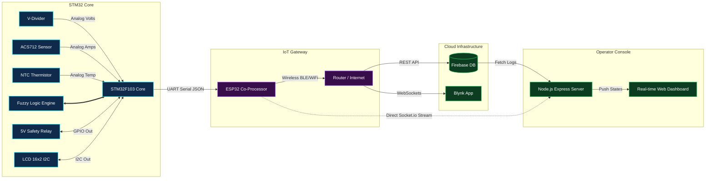

<p align="center">
  
</p>

<p align="center">
  
  
  
  
  
  
</p>

<h3 align="center">━━━━━━━ ⚡ SYSTEM CONTROL HUB ━━━━━━━</h3>

<p align="center">
  ChargeIQ is an adaptive, AI-driven EV Charging System. Built on an <b>STM32F103</b> microcontroller core and paired with an <b>ESP32 co-processor</b>, it implements a real-time Fuzzy Logic engine that automatically modulates charging rates based on live telemetry (voltage, current, and temperature), safeguarding battery health and preventing thermal decay.
</p>

<br />

## 🪐 Project Workspace Directory

This repository is structured as a **Split Workspace (Monorepo)**, separating the backend controller service from the simulation presentation.

```yaml
CHARGEIQ-PLATFORM/
├── dashboard/            # Express.js Server + Real-time Telemetry Dashboard
│   ├── public/           # Dashboard Web App files (HTML, CSS, JS)
│   ├── server.js         # Node/Express main server
│   ├── socket.js         # Socket.io telemetry broadcaster
│   └── telemetry.db      # SQLite telemetry logs database
│
├── animations/           # Cinematic WebGL/Canvas Physics Presentation
│   ├── index.html        # Interactive presentation landing page
│   ├── css/              # Styling resources
│   └── js/               # Particle physics & scene animation scripts
│
└── assets/               # Workspace SVG media and banners
```

---

## ⚡ Technical Architecture

The telemetry pipeline aggregates raw physical measurements, feeds them to the fuzzy logic engine, and relays the state wirelessly:



---

## 🛠️ Workspace Deployment Guide

You can open and run either component completely independently.

### 🎮 Running the Animations & Simulation

The cinematic presentation simulates the hardware behavior, sensor data generation, and cloud transmission in a beautiful canvas-based physics animation.

1. **Direct browser execution**:
   - Double-click the file [animations/index.html](file:///c:/Users/rajak/OneDrive/Desktop/CHARGEIQ%20MAIN%20EL%20DASHBOARD/animations/index.html) to open the presentation instantly.
2. **Local HTTP Server execution**:
   - Open a terminal at `animations/` and start a static server:
     ```bash
     python -m http.server 8080
     ```
   - Open [http://localhost:8080](http://localhost:8080) in your web browser.

---

### 📊 Running the SCADA Telemetry Dashboard

The dashboard aggregates database logs, handles command signals (UART connection), and updates charging states on a real-time monitor.

1. Go into the dashboard directory:
   ```bash
   cd dashboard
   ```
2. Install Node dependencies:
   ```bash
   npm install
   ```
3. Boot the Express Server:
   ```bash
   npm run start
   ```
4. Access the telemetry console:
   - Monitor URL: [http://localhost:3000/dashboard.html](http://localhost:3000/dashboard.html)
   - Landing Portal: [http://localhost:3000/index.html](http://localhost:3000/index.html)

---

## 🔮 Hardware Core Highlights
> [!TIP]
> **Fuzzy Logic Engine**: Implements dynamic current throttling. If NTC thermistor temperatures approach critical levels (>42°C), charging switches from FAST mode (1.5A) to MEDIUM (0.8A) or stand-by, protecting lead-acid cells from swelling.
> 
> **ESP32 Co-Processing**: Relieves STM32 clock-cycles from TCP/IP stack overhead, handling direct socket client handshakes and databases asynchronously.

<p align="center">━━━━━━━ ⚡ RVCE SCADA CORE ━━━━━━━</p>
